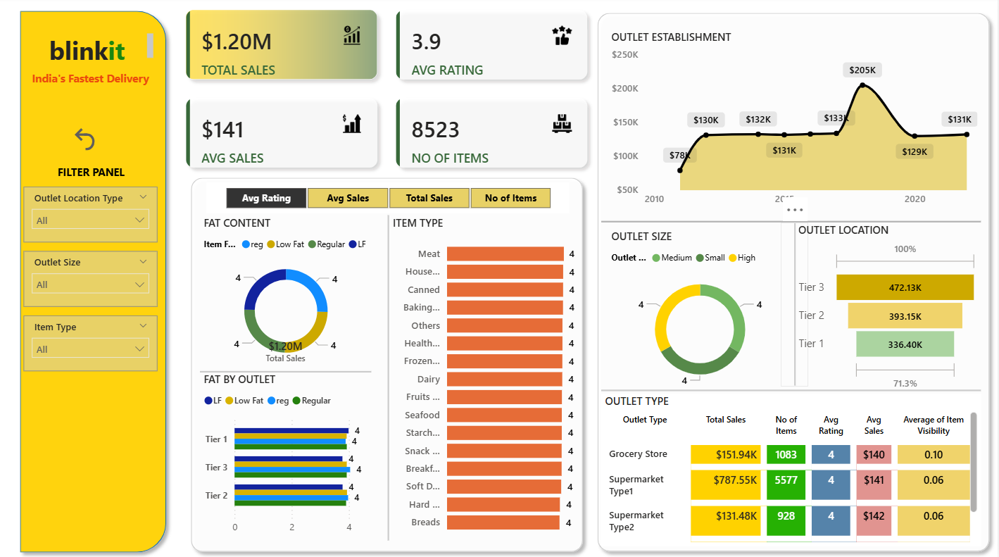

# 🛒 Blinkit Sales Dashboard (Power BI)

📊 A comprehensive sales analytics dashboard for **Blinkit**, designed as part of the MCA coursework in **Cloud Computing & DevOps**.  
This project provides actionable insights into sales performance, customer satisfaction, and inventory distribution using **Power BI** and **DAX**.

---

## 📖 Project Overview  
The Blinkit Sales Dashboard visualizes sales data to help stakeholders analyze business performance and make data-driven decisions.  

**Key Performance Indicators (KPIs):**
- **Total Sales:** $1.20 Million  
- **Average Sales per Transaction:** $141  
- **Number of Items Sold:** 8,523  
- **Average Customer Rating:** 3.9 / 5  

---

## 📈 Key Features
- **Visualizations:** Donut charts, bar charts, stacked column charts, line charts, pie charts, funnel maps, and matrix cards  
- **Sales Trends:** Monthly and yearly sales performance insights  
- **Customer Preferences:** Popular items, ratings, and purchase behavior  
- **Outlet Performance:** Comparison by outlet type, size, and location  
- **Analysis Objectives:**
  - Customer segmentation  
  - Inventory management & distribution  
  - Profitability and trend analysis  

---

## 🛠️ Tools & Technologies  
- **Power BI** for data modeling and visualization  
- **DAX** for advanced calculations  
- **Excel / SQL** for initial data cleaning and preparation  
- **Windows OS** for project development and execution  

---

## 📁 Repository Structure  
```
Blinkit-Sales-Dashboard/
│-- data/               # Raw & cleaned datasets
│-- dashboard/          # Power BI .pbix file
│-- screenshots/        # Dashboard screenshots
│-- README.md           # Project documentation
```

---

## 📊 Dashboard Preview  

Take a look at the Blinkit Sales Dashboard for quick insights:  

  

> 🎯 Designed for clarity, interactivity, and actionable insights.

---

## 🚀 Getting Started  

1. **Clone the repository**  
   ```bash
   [https://github.com/rohitjaiswalrj32/Blinkit_Sales_Dashboard.git]
   ```
2. **Open the .pbix file** in **Power BI Desktop**.  
3. **Explore the dashboard** using filters and drill-downs for insights.  

---

## 📚 Project Sections  
- **Project Scope**  
- **Research Methodology**  
- **Requirement Analysis**  
- **Cost Estimation**  
- **Dashboard Review**  
- **Conclusion & Future Enhancements**  

---

## 🤝 Contributions  
Contributions, issues, and feature requests are welcome!  
Feel free to open an **issue** or submit a **pull request**.

---

## 📜 License  
Specify the license for your project here (e.g., MIT, Apache 2.0).  

---

## 👤 Author  
**Rohit Jaiswal**  
MCA | Aspiring Data Analyst  
📧 [rohitjaiswalrj32@gmail.com](mailto:rohitjaiswalrj32@gmail.com)  
🔗 [LinkedIn](https://www.linkedin.com/in/rohitjaiswalrj32/) | [GitHub](https://github.com/rohitjaiswalrj32)  
